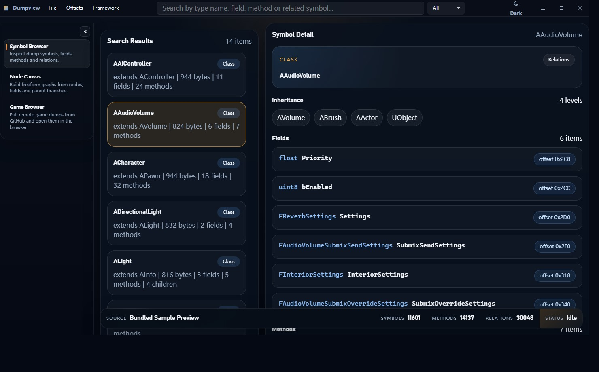
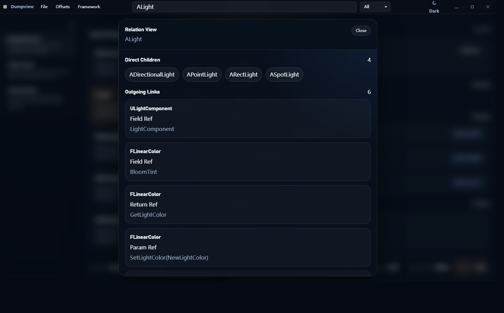
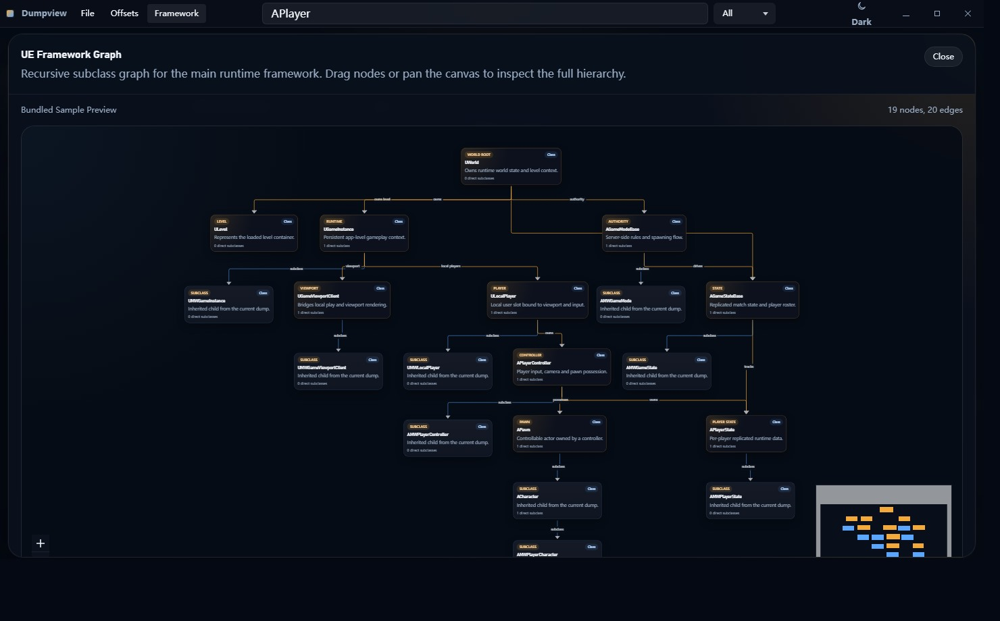
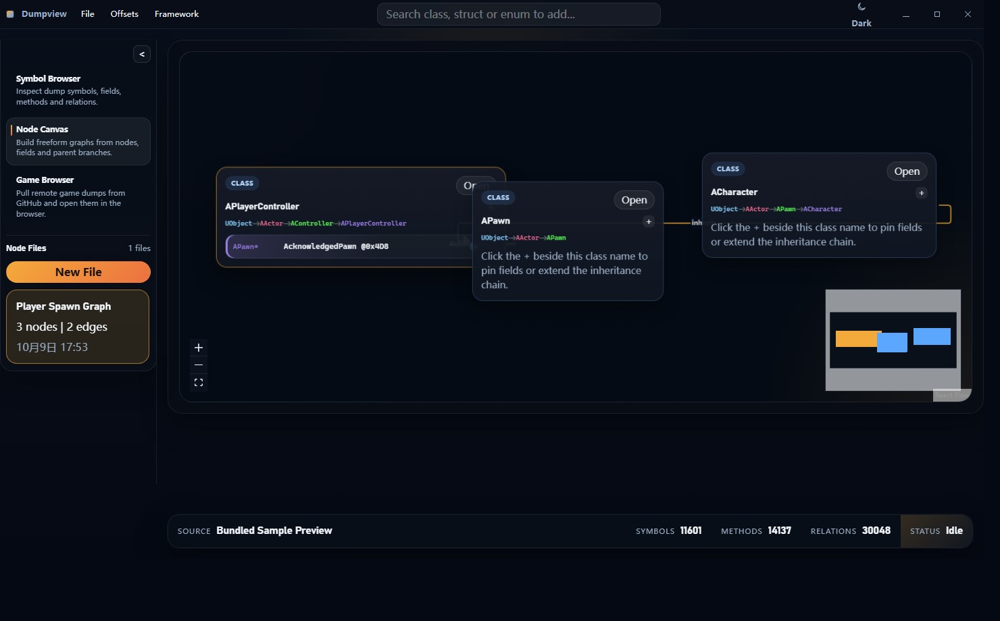
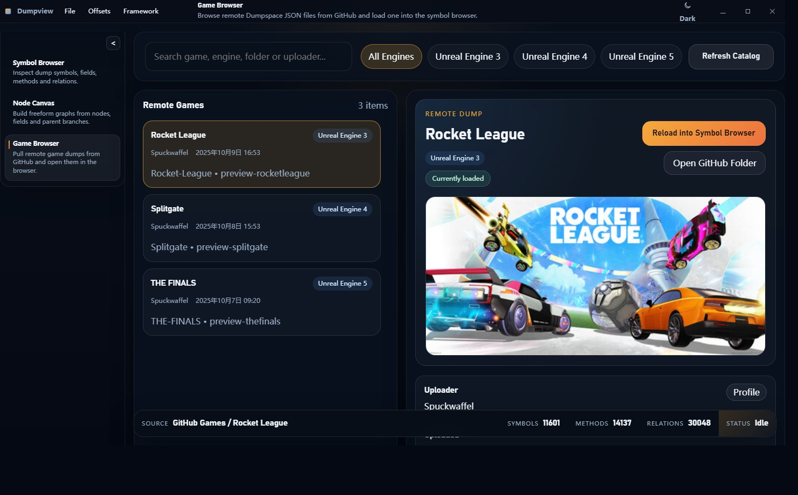

# dumpview

[English](./README.md) | [Chinese](./README.zh-CN.md)

`dumpview` is a desktop viewer for the JSON files generated by [Dumper-7](https://github.com/Encryqed/Dumper-7). Those JSON files are tailored for the [Dumpspace](https://github.com/Spuckwaffel/dumpspace) ecosystem, and this project focuses on browsing Unreal Engine reflection data more comfortably than reading raw JSON directly.

It provides fast local search, symbol inspection, offset browsing, relation popovers, a freeform node canvas, a UE framework graph, a GitHub-backed game browser, and light/dark theme switching in a Tauri desktop UI.

This project does not generate dumps by itself. Generate a `Dumpspace` folder with Dumper-7 first, then load that folder in `dumpview`.

## Features

- Load a `Dumpspace` directory and read `ClassesInfo.json`, `StructsInfo.json`, `FunctionsInfo.json`, `EnumsInfo.json`, and optional `OffsetsInfo.json`
- Build a local SQLite FTS5 index for fast search across type names, fields, methods, and related symbols
- Inspect classes, structs, and enums with parent chains, direct children, fields, methods, related symbols, and incoming references
- Render fields and methods in a more C++-like format for easier reading
- Group shared offsets to make packed flags and overlapping fields easier to spot
- Browse offsets from the title bar through the `Offsets` popup
- Open a `Relation View` popup from the symbol detail card
- Switch between `Symbol Browser`, `Node Canvas`, and `Game Browser` from the sidebar
- Build freeform symbol graphs in `Node Canvas` and save them as reusable node files
- Open a `Framework` popup that shows a UE core framework graph
- Recursively display subclass chains inside the framework graph and support pan, zoom, and node dragging
- Browse the public `Games` catalog from the Dumpspace GitHub repository and load a remote dump directly into the browser
- Toggle between dark and light themes from the title bar
- Keep search history per loaded project

## Screenshots

### Main View



### Relation View



### UE Framework Graph



### Node Canvas



### Game Browser



## Tech Stack

- Tauri 2
- React
- Vite
- TypeScript
- Rust
- SQLite FTS5
- React Flow + dagre for the framework graph and node canvas

## Supported Input

`dumpview` expects a `Dumpspace` folder. A minimal layout looks like this:

```text
Dumpspace/
  ClassesInfo.json
  StructsInfo.json
  FunctionsInfo.json
  EnumsInfo.json
  OffsetsInfo.json
```

`OffsetsInfo.json` is optional. The other four JSON files are expected.

The repository also includes a sample dump under [`dump/Dumpspace`](./dump/Dumpspace) for quick testing.

## Getting Started

### Requirements

- Node.js
- Rust toolchain
- Windows is the current primary development and testing target

### Install Dependencies

```powershell
npm install
```

### Run the Desktop App

```powershell
npm run dev
```

On Windows, the local launcher script also tries to add `~/.cargo/bin` to `PATH` before starting Tauri, which helps when `cargo` is installed but not visible in the current shell.

If you only want the frontend dev server without the desktop shell, run:

```powershell
npm run frontend:dev
```

The repository already includes the local Tauri CLI through npm, so a global `cargo-tauri` installation is not required.

### Build

Frontend build:

```powershell
npm run build
```

Desktop build:

```powershell
npm.cmd run tauri -- build
```

## Usage

1. Start the app.
2. Load the bundled sample dump, pick your own `Dumpspace` folder, or open `Game Browser` and load a remote dump from GitHub.
3. Search by type name, field name, method name, or related symbol in `Symbol Browser`.
4. Use `Node Canvas` to build and save custom symbol graphs.
5. Inspect details, relations, offsets, the UE framework graph, and switch themes from the main UI.

## Notes

- Best experience is in the Tauri desktop app
- Some desktop-oriented interactions are not meant for plain browser preview mode
- The framework graph currently starts from a fixed UE core skeleton and expands using the currently loaded dump data
- Remote game browsing reads the public Dumpspace GitHub catalog; loading a remote dump into the local index still works best inside the Tauri desktop app

## Credits

- Dumper-7: https://github.com/Encryqed/Dumper-7
- Dumpspace: https://github.com/Spuckwaffel/dumpspace
